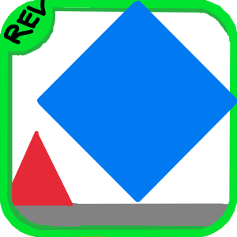

# Geometry Splash
A clone of the popular game 'Geometry Dash' created purely for educational purposes. <br>
If you want to play an actually fun game, you should probably go play the real Geometry Dash.



# Notes
- I am aware the game is capped at 60 fps. This is because all calculations rely on happening every 16 ms, if the FPS were to change
it would get inconsistant. I considered fixing this but since this project has came pretty far already, it'd take a lot of time to fix every
spot, so it'll just have to stay the way it is.

## To Run
```console
$ python3 geo.py
```
## To Compile (Using Pyinstaller) Tested on Windows & Linux
### Tested with Python 3.11
```console
$ python3 ./compile.py
```

## Alternatively, you can use Nuitka to compile it but keep the following notes in mind.

### Windows NOTE:

- Windows Defender will block it, I'm not sure why though.

### MacOS NOTE:
- Ensure you have `pip install imageio`, so that the icon is setup properly on the executable.

### Linux NOTE:
- Ensure you have python3.11-devel installed.